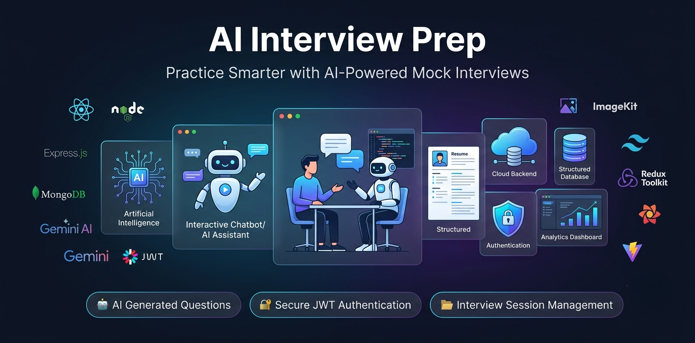
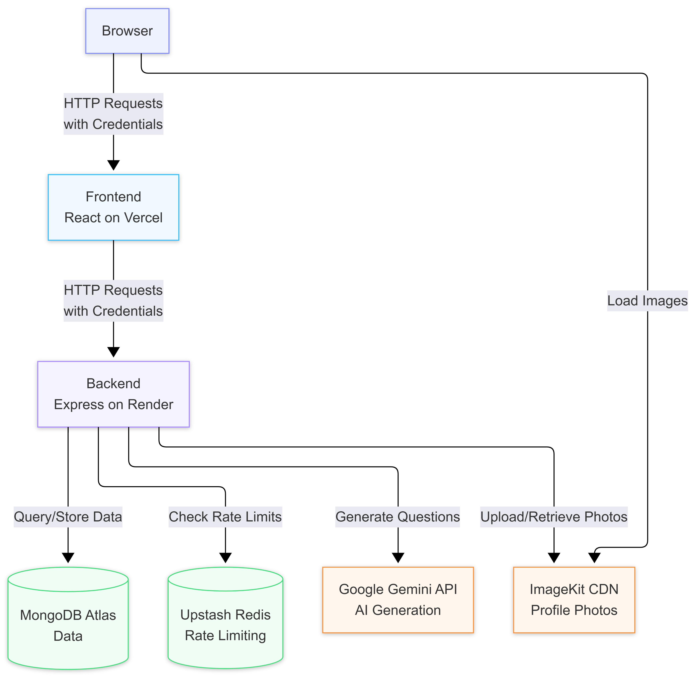
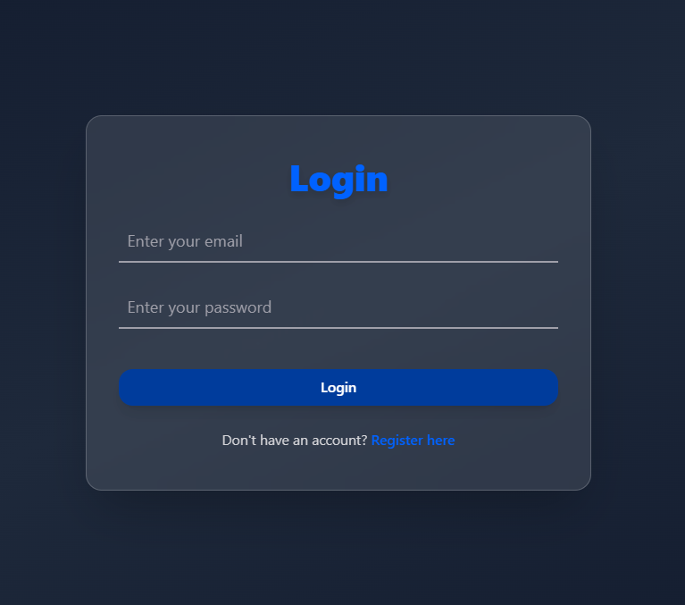
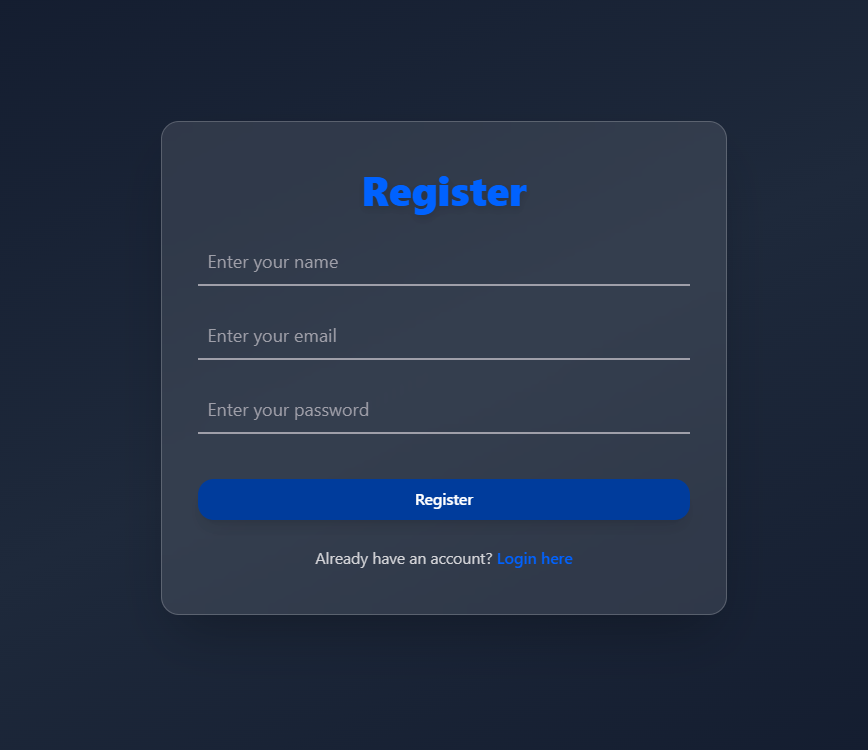
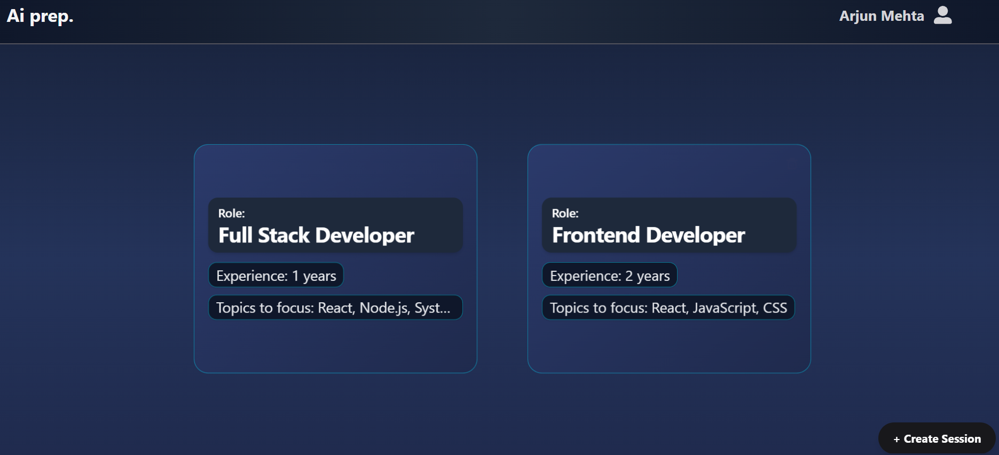
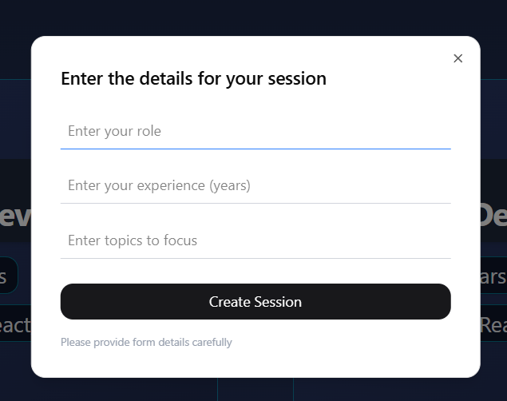
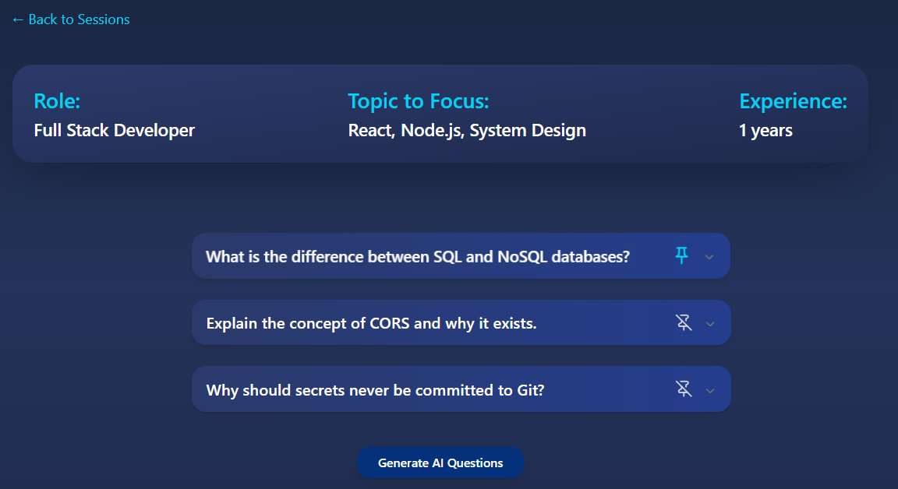
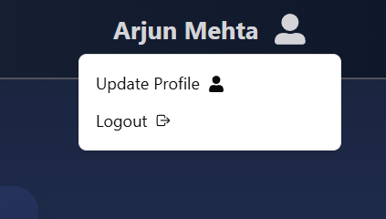
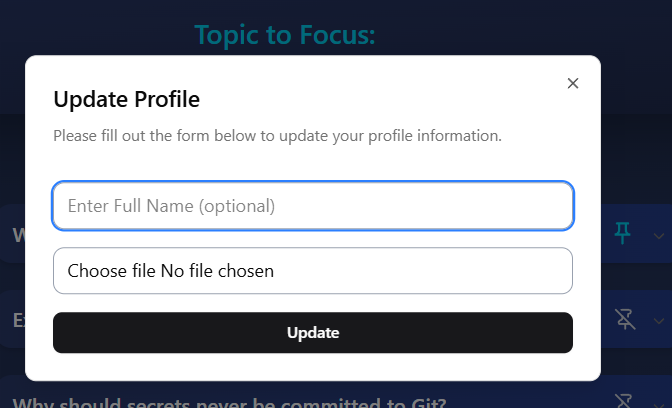

# 🤖 AI Interview Prep
<p align="center">  </p> <p align="center"> <strong>Practice Smarter with AI-Powered Mock Interviews</strong> </p>

A full-stack AI-powered interview preparation app that helps you practice mock interviews with personalized questions generated by Google Gemini AI.


## ⭐ Highlights

- Production-ready authentication
- AI-generated interview questions
- Secure cookie-based authentication
- Modular backend architecture
- Image upload support

---


## 🏗️ System Architecture

<p align="center">
  
</p>

<p align="center">
  <em>High-level architecture showing the interaction between the React frontend, Express backend, Google Gemini AI, MongoDB, and ImageKit.</em>
</p>


---
## 🔐 Login Page


<p align="center">
  
</p>

<p align="center">
  <em>Secure email/password and Google OAuth authentication with JWT stored in HttpOnly cookies.</em>
</p>

---
## 📝 Register

<p align="center">
  
</p>

<p align="center">
  <em>Create a new account with validation, secure password hashing, and profile initialization.</em>
</p>

---
## 🏠 Dashboard

<p align="center">
  
</p>

<p align="center">
  <em>Overview of interview sessions with quick access to create, review, and manage interviews.</em>
</p>

---

## ✨ Create Interview Session

<p align="center">
  
</p>

<p align="center">
  <em>Generate personalized interview sessions by selecting role, experience level, and interview topics.</em>
</p>

---
## 🤖 Interview Session

<p align="center">
  
</p>

<p align="center">
  <em>Practice AI-generated interview questions, review answers, and pin important questions for future revision.</em>
</p>

---
## 👤 User Menu

<p align="center">
  
</p>

<p align="center">
  <em>Quick access to profile settings, account management, and logout functionality.</em>
</p>

---
## 🖼️ Profile Management

<p align="center">
  
</p>

<p align="center">
  <em>Update profile information and upload profile images securely using ImageKit.</em>
</p>

---

## ✨ Features

- 🔐 **Authentication** — Secure register/login with JWT cookies
- 📁 **Interview Sessions** — Create sessions by role, experience, and topics
- 🤖 **AI Question Generation** — Get personalized interview Q&A powered by Google Gemini 2.5 Flash
- 📌 **Pin Questions** — Pin important questions for quick review
- 👤 **Profile Management** — Update name and profile photo (via ImageKit)
- 🛡️ **Security** — Helmet, CORS, rate limiting, Zod validation

---
## 🔐 Authentication Flow

<p align="center">
  
</p>

<p align="center">
  <em>Authentication process using JWT, HttpOnly cookies, and Google OAuth.</em>
</p>

---
## 🛡️ Secure API Request Handling

<p align="center">
  
</p>

<p align="center">
  <em>Every incoming request passes through multiple security layers including Helmet, CORS, rate limiting, authentication, and Zod validation.</em>
</p>

---

## 🛠️ Tech Stack

### Backend
| Tech | Purpose |
|------|---------|
| Node.js + Express | REST API server |
| MongoDB + Mongoose | Database |
| JWT + Cookies | Authentication |
| Google Gemini 2.5 Flash | Question generation |
| ImageKit | Profile photo storage |
| Zod | Request validation |
| Helmet + CORS | Security |
| express-rate-limit | Rate limiting |


### Frontend
| Tech | Purpose |
|------|---------|
| React + Vite | UI framework |
| Redux Toolkit + Persist | State management |
| TanStack Query | Server state & caching |
| Axios | HTTP requests |
| React Hook Form | Form handling |
| Tailwind CSS | Styling |
| Framer Motion | Animations |
| Shadcn/ui | UI components |

---

## 📁 Project Structure

```
AI_Interview/
├── Backend/
│   ├── src/
│   │   ├── config/              # Database, ImageKit, Redis, environment
│   │   ├── controllers/         # User, session, interview controllers
│   │   ├── middlewares/         # Auth, error handler, validation, rate limiter
│   │   ├── models/              # Mongoose models
│   │   ├── routes/              # API routes
│   │   ├── services/            # Business logic
│   │   ├── utils/               # AppError, asyncHandler, API response helpers
│   │   ├── validators/          # Zod validation schemas
│   │   └── app.js               # Express app configuration
│   ├── .env.example
│   ├── package.json
│   └── package-lock.json
│
├── Frontend/
│   ├── src/
│   │   ├── Pages/               # Login, Register, Dashboard, Interview, Results
│   │   ├── Routes/              # Protected & public routes
│   │   ├── Store/               # Redux Toolkit store
│   │   ├── Components/          # Reusable UI components
│   │   ├── utils/               # Axios instance, helpers
│   │   ├── App.jsx
│   │   └── main.jsx
│   ├── .env.example
│   ├── package.json
│   └── package-lock.json
│
├── docs/
│   ├── images/                  # README banners, screenshots, diagrams   
│   └── postman/
│       └── AI_Interview_API.postman_collection.json
│
├── .gitignore
├── LICENSE
└── README.md
```

---

## 🚀 Getting Started

### Prerequisites
- Node.js v18+
- Docker Desktop (for Redis)
- MongoDB (local or Atlas)
- Google Gemini API key
- ImageKit account

### 1. Clone the repository

```bash
git clone https://github.com/Siddhi561/AI_InterviewPrep.git
cd AI_InterviewPrep
```

### 2. Backend Setup

```bash
cd Backend
npm install
```

Create a `.env` file in the `Backend` folder:

```env
MONGODB_URI=your_mongodb_connection_string
SECRET_KEY=your_jwt_secret_key
GEN_AI=your_gemini_api_key
IMAGEKIT_PUBLIC_KEY=your_imagekit_public_key
IMAGEKIT_PRIVATE_KEY=your_imagekit_private_key
IMAGEKIT_URL_ENDPOINT=your_imagekit_url_endpoint
NODE_ENV=development
PORT=3000
CLIENT_URL=http://localhost:5173
```

Start the backend:
```bash
npm run dev
```

Backend runs on `http://localhost:3000`  


### 3. Frontend Setup

```bash
cd Frontend
npm install
npm run dev
```

Frontend runs on `http://localhost:5173`

---
---

# 🌱 Database Seeder

The project includes a database seeder that populates MongoDB with realistic demo data for quick testing and development.

### What gets seeded?

- 👤 2 Demo Users
- 📂 3 Interview Sessions
- 🤖 9 AI Interview Questions
- 📌 Pinned & Unpinned Questions
- 🔗 Proper relationships between Users, Sessions, and Questions

---

### Demo Accounts

| User | Email | Password |
|------|-------|----------|
| Demo User 1 | `arjun@example.com` | `Test@1234` |
| Demo User 2 | `priya@example.com` | `Test@1234` |

---

### Seed Database

Populate an empty database:

```bash
npm run seed
```

This command:

- Creates demo users
- Creates interview sessions
- Creates interview questions
- Links questions to their respective sessions
- Hashes passwords using bcrypt before storing them

---

### Fresh Seed

Delete existing data and recreate everything from scratch:

```bash
npm run seed:fresh
```

This command:

- Deletes all Users
- Deletes all Sessions
- Deletes all Questions
- Inserts a fresh set of demo data
- Rebuilds all document relationships

> **Note:** `seed:fresh` permanently removes existing data before inserting the demo dataset.

---

### Example Seeder Output

```text
Connected to MongoDB

Created 2 users
Created 3 sessions
Created 9 questions

── Seed complete ──────────────────────────

Email: arjun@example.com
Password: Test@1234

Email: priya@example.com
Password: Test@1234

────────────────────────────────────────────
```

---

## 📡 API Routes

### User
| Method | Route | Auth | Description |
|--------|-------|------|-------------|
| POST | `/api/v1/user/register` | ❌ | Register new user |
| POST | `/api/v1/user/login` | ❌ | Login user |
| POST | `/api/v1/user/logout` | ✅ | Logout user |
| GET | `/api/v1/user/me` | ✅ | Get current user |
| PUT | `/api/v1/user/update-profile` | ✅ | Update name/photo |

### Session
| Method | Route | Auth | Description |
|--------|-------|------|-------------|
| POST | `/api/v1/session/create` | ✅ | Create interview session |
| GET | `/api/v1/session/my-session` | ✅ | Get all user sessions |
| GET | `/api/v1/session/:id` | ✅ | Get session by ID |
| DELETE | `/api/v1/session/:id` | ✅ | Delete session |

### Question
| Method | Route | Auth | Description |
|--------|-------|------|-------------|
| POST | `/api/v1/question/generate` | ✅ | Generate AI questions |
| PATCH | `/api/v1/question/:id/pin` | ✅ | Toggle pin question |

---

## 🔒 Security Features

- **JWT** stored in `httpOnly` cookies — safe from XSS
- **Helmet** — sets secure HTTP headers
- **CORS** — restricted to frontend origin only
- **Rate Limiting** — 3 separate limiters:
  - General: 100 requests / 15 min
  - Auth: 10 requests / 15 min  
  - AI: 20 requests / 1 hour
- **Zod validation** — all request bodies validated
- **bcrypt** — passwords hashed with 10 salt rounds

---

## 💻 Local Development

This project is configured for local development using Docker for Redis and either a local MongoDB instance or MongoDB Atlas.

### Services

| Service     | Default URL                       |
| ----------- | --------------------------------- |
| Frontend    | `http://localhost:5173`           |
| Backend API | `http://localhost:3000`           |
| MongoDB     | Local or MongoDB Atlas            |
| Redis       | `redis://localhost:6379` (Docker) |

### Running Redis with Docker

Start a local Redis container:

```bash
docker run -d \
  --name redis \
  -p 6379:6379 \
  redis:7-alpine
```

Verify that Redis is running:

```bash
docker ps
```

### Start the Backend

```bash
cd Backend
npm install
npm run dev
```

The backend will be available at:

```text
http://localhost:3000
```

### Start the Frontend

```bash
cd Frontend
npm install
npm run dev
```

The frontend will be available at:

```text
http://localhost:5173
```

### Local Environment

Example backend environment variables:

```env
MONGODB_URI=your_mongodb_connection_string
SECRET_KEY=your_jwt_secret_key
GEN_AI=your_gemini_api_key

IMAGEKIT_PUBLIC_KEY=your_imagekit_public_key
IMAGEKIT_PRIVATE_KEY=your_imagekit_private_key
IMAGEKIT_URL_ENDPOINT=your_imagekit_url_endpoint

REDIS_URL=redis://localhost:6379

CLIENT_URL=http://localhost:5173

NODE_ENV=development
PORT=3000
```

> **Note:** This project is configured for local development. Redis runs in a Docker container on `localhost:6379`. If you deploy the application in the future, replace the local Redis instance with a hosted Redis service and update the environment variables accordingly.


## 🚀 Future Improvements

- Voice-based interviews
- AI feedback scoring
- Interview analytics dashboard
- Resume parsing
- Multi-language support
---

## 🤝 Contributing

1. Fork the project
2. Create your feature branch: `git checkout -b feature/amazing-feature`
3. Commit your changes: `git commit -m 'Add amazing feature'`
4. Push to the branch: `git push origin feature/amazing-feature`
5. Open a Pull Request

---

## 📄 License

This project is licensed under the MIT License.

---

## 👨‍💻 Author

Built as a production-inspired MERN portfolio project showcasing secure authentication, AI integration, REST APIs, and modern full-stack development practices.

If you found this project useful, consider giving it a ⭐.
